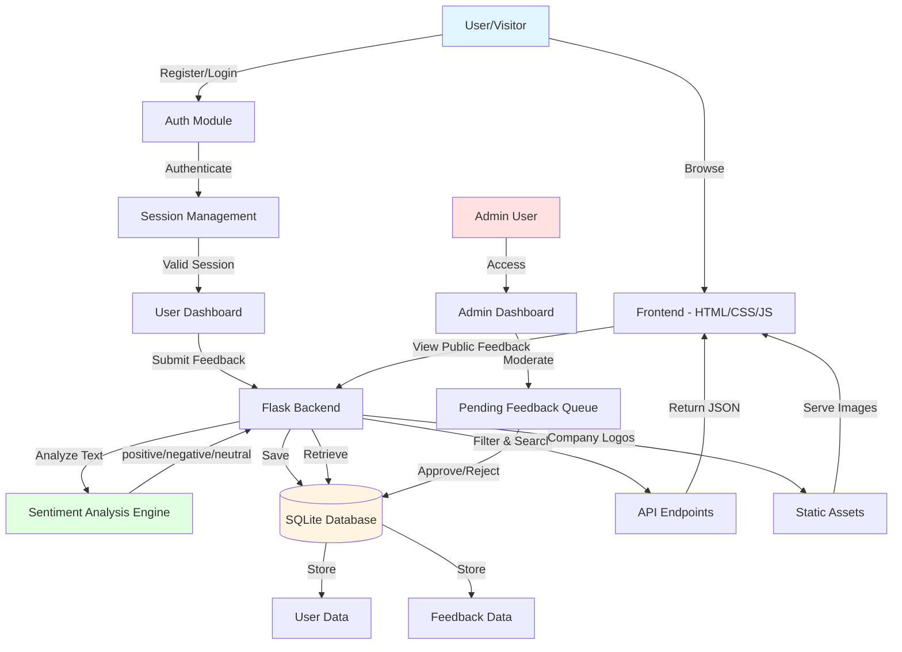

# Openfeed

Openfeed is an open feedback platform where users can submit and view company feedback in real-time. Features include sentiment analysis, company logos, and a responsive card-based interface.

## Features

- Submit feedback for 30+ major companies

- Automatic sentiment analysis (positive/neutral/negative)

- Real-time feedback cards with hover animations

- Responsive design for mobile and desktop

- Local logo storage for instant loading

- SQLite database for persistence

## Quick Start

```bash

pip install -r requirements.txt

python app.py

```

Visit `http://localhost:5000`

## Tech Stack

- Flask (Python web framework)

- Flask-SQLAlchemy (database ORM)

- SQLite (lightweight database)

- HTML/CSS/JavaScript (frontend)

- Docker (containerization)

## Architecture Diagram



**Flow Description:**
1. **User Registration/Login**: Users authenticate via the auth module with session management
2. **Feedback Submission**: Logged-in users submit feedback for companies
3. **Sentiment Analysis**: Text is automatically analyzed for positive/negative/neutral sentiment
4. **Database Storage**: All data persists in SQLite database
5. **Admin Moderation**: Admins review and approve/reject pending feedback
6. **Public Display**: Approved feedback is displayed to all visitors with filtering and search capabilities

## Project Structure

```

openfeed/

├── app.py              # Main Flask application

├── requirements.txt    # Python dependencies

├── Dockerfile          # Docker configuration

├── static/             # CSS, JS, logos

├── templates/          # HTML templates

├── tests/              # Unit tests

├── .github/workflows/  # GitHub Actions CI/CD

└── .gitlab-ci.yml      # GitLab CI/CD

```

## Working on a Branch (GitHub)

1. Fetch latest: `git fetch origin`
2. Update main then branch: `git checkout main && git pull origin main && git checkout -b feature/your-branch` (or if already on an updated main: `git checkout -b feature/your-branch`)
3. Commit locally: `git add .` then `git commit -m "feat: describe change"`
4. Push branch: `git push -u origin feature/your-branch`
5. Open a pull request on GitHub targeting `main`.

## CI/CD Pipelines

- Automated testing with pytest

- Docker image builds

- GitHub Actions + GitLab CI/CD support

## Companies Supported

Google, Apple, Microsoft, Amazon, Netflix, Tesla, Facebook, Twitter, Spotify, and 22 more.

## License
MIT License